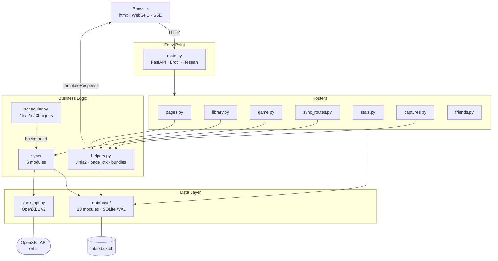

# Xbox Profile Dashboard

A self-hosted Xbox gaming dashboard built on the [OpenXBL API](https://www.openxbl.com/). It pulls your entire game library, achievements, screenshots, and friends list into a fast, searchable web interface with a WebGPU glass renderer, three themes (light / dark / OLED), and a fully chronological timeline of your gaming history.

No React. No Node.js. Server-rendered HTML, htmx for SPA-like interactivity, and a single Python process.

## Features

- **Library** — searchable, sortable, filterable game table with grid view and CSV/JSON export
- **Game Detail** — per-game achievement grid, hero image, and manual tracking (status, notes, rating, finish date)
- **Timeline** — chronological gaming history combining achievement unlocks, completions, and first-played events
- **Achievements** — paginated achievement browser with rarity tiers (Common / Rare / Epic / Legendary)
- **Screenshots** — gallery of Xbox clips and captures grouped by game
- **Friends** — online presence status and gamerscore, sorted by activity
- **Activity heatmap** — GitHub-style calendar of your achievement unlocks, by month or year
- **Background sync** — APScheduler syncs library (every 4h), game details (2h), and friends (30m)
- **PWA** — installable, with service worker and manifest
- **WebGPU glass renderer** — physically-based glass panels with Fresnel, chromatic aberration, and aurora background; WebGL2 fallback for unsupported browsers

## Quick Start

**Prerequisites:** Python 3.12+, a free [OpenXBL API key](https://www.openxbl.com/) (150 req/hour)

```bash
# 1. Install dependencies
pip install -r requirements.txt

# 2. Configure — only one variable is required
cp .env.example .env
# Edit .env and set OPENXBL_API_KEY=your_key_here

# 3. Start the server
uvicorn main:app --reload --port 8000
```

Open http://localhost:8000. The SQLite database is created automatically on first run. Your XUID and gamertag are resolved from the API — no manual lookup needed.

## Configuration

| Variable | Required | Description |
|----------|----------|-------------|
| `OPENXBL_API_KEY` | Yes | Free key from openxbl.com |
| `XBOX_GAMERTAG` | No | Override auto-resolved gamertag |
| `XBOX_XUID` | No | Override auto-resolved XUID |
| `XBOX_DEV` | No | Set to `1` to enable CSS hot-rebuild during development |

All other behaviour (rate budgets, sync concurrency, pagination sizes) is configured in `config.py`.

## Pages

| Route | Description |
|-------|-------------|
| `/` | Profile — stats cards, charts, activity heatmap, recently completed |
| `/library` | Library — searchable/sortable table with filters, grid view, CSV/JSON export |
| `/game/{title_id}` | Game Detail — hero image, achievement grid, manual tracking form |
| `/timeline` | Timeline — chronological gaming history (unlocks, completions, first-played) |
| `/achievements` | Achievements — filterable, paginated browser with rarity tiers |
| `/captures` | Screenshots — gallery grouped by game |
| `/friends` | Friends — online presence and gamerscore |

## API Rate Limits

OpenXBL free tier: **150 requests/hour**. The app auto-detects your plan's limit from API response headers and keeps a 5-call safety buffer. Current usage is shown in the nav bar.

| Operation | API calls |
|-----------|-----------|
| Sync full library | 1 |
| Per-game detail (stats + achievements + player progress) | 3 |
| Friends sync | 1 |

With a large library, per-game detail fetches are spread across multiple scheduler runs to stay within budget.

## Architecture



The app is a single FastAPI process. Routers handle HTTP — pages render Jinja2 templates, API routes return JSON or SSE streams. The `database/` layer is 13 domain-focused modules behind a clean async interface (`aiosqlite`, WAL mode). The `sync/` layer is 6 modules that orchestrate OpenXBL API calls, budget them against the rate limit, and upsert results without touching manual tracking fields.

### Key Patterns

- **Repository pattern** — all database access through `database/` modules; import from `database`, not submodules
- **Service pattern** — sync orchestration in `sync/`; a single async mutex prevents concurrent syncs
- **Config-driven** — all policy constants (rate limits, concurrency, budget percentages, page sizes) in `config.py`
- **Upsert preserves manual data** — `status`, `notes`, `rating`, `finished_date` are never overwritten by sync
- **Change detection** — only games that differ from the last fetch are re-synced
- **TTL cache** — in-memory cache with coordinated invalidation on writes; all keys are constants in `CacheKey`

## Project Structure

```
├── main.py              # FastAPI app, lifespan, middleware, router includes
├── config.py            # All policy constants (rate limits, concurrency, page sizes)
├── helpers.py           # Jinja2 filters, page_ctx(), CSS/JS bundle builder
├── xbox_api.py          # OpenXBL API client (httpx async, identity auto-resolve)
├── scheduler.py         # APScheduler background jobs
├── models.py            # Pydantic models (ApiError, TrackingUpdate, SyncResult)
├── database/            # 13 async aiosqlite modules (import from `database`, not submodules)
│   ├── connection.py    # Global connection pool, PRAGMA tuning
│   ├── setup.py         # Schema creation and ALTER TABLE migrations
│   ├── games.py         # Upsert preserving manual tracking, game queries
│   ├── achievements.py  # Achievement upsert, progress, pagination
│   ├── stats.py         # Dashboard stats, rarity breakdown (cached)
│   ├── timeline.py      # UNION ALL query (unlocks + completions + first-played)
│   └── ...              # heatmap, screenshots, friends, sync, rate_limit, cache, settings, validators
├── sync/                # 6 sync orchestration modules (import from `sync`, not submodules)
│   ├── core.py          # sync_guard mutex, budget fitting, fire_and_forget
│   ├── orchestrator.py  # Unified SSE sync (4 phases)
│   ├── games.py         # Library sync, per-game detail, change detection
│   └── ...              # achievements, profile, screenshots
├── routers/             # One FastAPI router per domain
├── templates/           # 21 Jinja2 templates (base, macros, pages, partials)
└── static/
    ├── css/             # 16 domain CSS files → bundle.css (built at startup)
    └── js/
        ├── src/         # 17 JS modules → app.js (built at startup)
        ├── glass-webgpu.js  # WebGPU renderer
        └── glass.js         # WebGL2 fallback
```

## Database Schema

Nine tables: `games`, `achievements`, `screenshots`, `friends`, `sync_log`, `sync_failures`, `rate_limit_log`, `settings`, `schema_migrations`.

**`games`** — `title_id` (PK), `name`, `display_image`, `devices` (JSON), `current/total_gamerscore`, `progress_percentage`, `minutes_played`, `last_played`, `is_gamepass`, `blurhash`
Manual tracking (never overwritten by sync): `status` (unset/backlog/playing/finished/dropped), `notes`, `rating`, `finished_date`

**`achievements`** — `achievement_id` + `title_id` (composite PK), `name`, `gamerscore`, `progress_state` (Achieved/NotStarted/InProgress), `time_unlocked`, `rarity_category` (Common/Rare/Epic/Legendary), `rarity_percentage`, `is_secret`

**`screenshots`** — `content_id` (PK), `title_id`, `capture_date`, `download_uri`, `thumbnail_small_uri`, `thumbnail_large_uri`, `resolution_width/height`, `file_size`

**`friends`** — `xuid` (PK), `gamertag`, `display_pic`, `gamer_score`, `presence_state`, `presence_text`

To add a column: add an `ALTER TABLE` entry to the `MIGRATIONS` list in `database/setup.py`. `CREATE TABLE IF NOT EXISTS` will not add missing columns to existing tables.

## OpenXBL API Notes

**Useful endpoints:**
- `/player/titleHistory/{xuid}` — full game list with achievements, Game Pass flag, and playtime
- `/achievements/player/{xuid}/{titleId}` — player progress including `time_unlocked`
- `/achievements/title/{titleId}` — achievement definitions with rarity and media
- `/achievements/stats/{titleId}` — `MinutesPlayed` stat

**Gotchas:**
- `displayImage` URLs come back as `http://` — rewritten to `https://` on ingest
- `totalAchievements` can be `0` even when achievements exist — use `progressPercentage` instead
- `time_unlocked` is `"0001-01-01T00:00:00Z"` for locked achievements — use `valid_ts_sql()` to filter
- There is no "first played" or "game started" endpoint — the app approximates it from the earliest achievement unlock

## Design

- **Fluent Design System** inspired (Xbox/Windows), with an Apple Liquid Glass material system
- **Xbox green:** `#107c10` (dark theme), `#0e6b0e` (light theme)
- **Rarity:** Common (gray) · Rare (blue) · Epic (purple) · Legendary (amber)
- **Tracking status:** Unset (gray) · Backlog (blue) · Playing (green) · Finished (purple) · Dropped (red)
- **Themes:** light / dark / OLED — toggled via `data-theme` + `data-oled` attributes, persisted in `localStorage`
- **Glass renderer:** WebGPU primary (`glass-webgpu.js`), WebGL2 fallback (`glass.js`) — physically-based with IOR 1.52, Fresnel, chromatic aberration, aurora background

## Development

```bash
# CSS hot-rebuild (watches 16 domain CSS files, rebuilds bundle.css)
XBOX_DEV=1 uvicorn main:app --reload --port 8000

# Production
uvicorn main:app --host 0.0.0.0 --port 8000
```

**Windows:** `start.bat` launches the dev server and opens the browser automatically.

**SQLite backups:** `litestream.yml` is pre-configured for local file replication. Uncomment the S3 section to replicate to any S3-compatible storage.

If `--reload` misses changes across multiple files, delete `__pycache__/` and restart.

## Gotchas

**htmx tbody swaps** — Only `<tr>` elements are accepted in tbody replacements. SVG `<defs>` must live in the parent template, not the partial.

**Glass + animation** — Never wrap glass elements in an animated container. The parent's `transform` transition creates a compositor layer that breaks `backdrop-filter` on children. Animate each glass element individually.

## Further Reading

`architecture.html` (open locally in a browser) contains an interactive diagram of the full system — hover any box for per-module details including line counts, key functions, and data flow.

